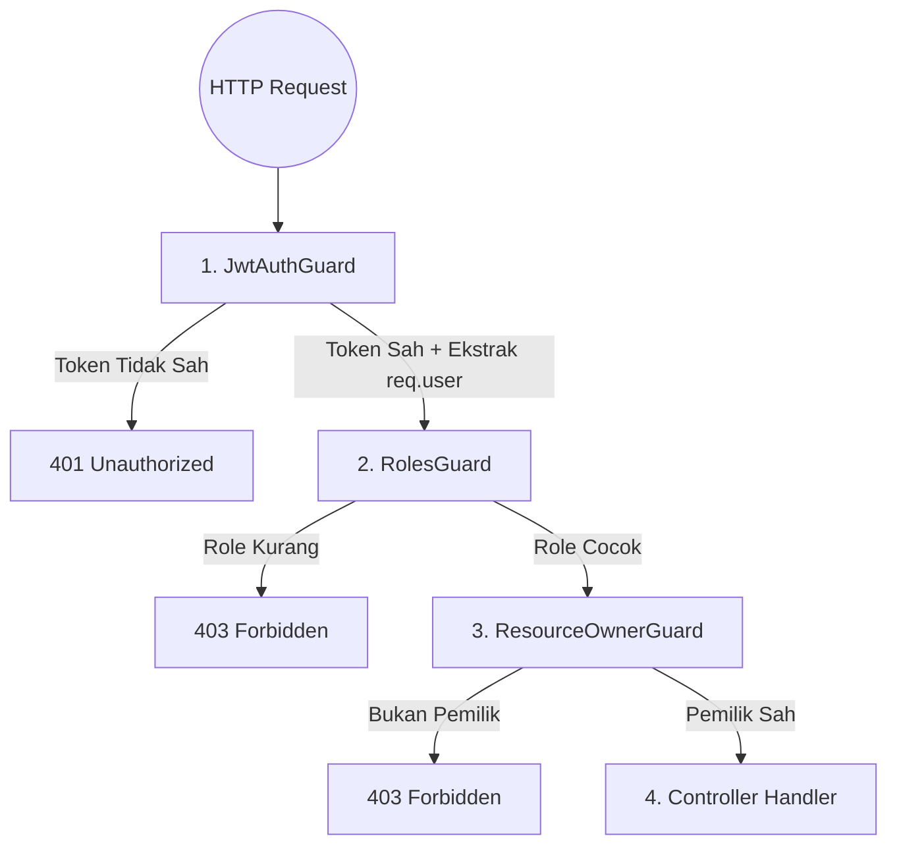

# 🟢 LEVEL 2 — MODUL 10: AUTHENTICATION & SECURITY
## LESSON 10.2: Authorization (RBAC), Permission Decorators, Execution Guards & OWASP Hardening

---

### 📋 Prerequisite & Metadata
- **Prerequisite:** [Lesson 10.1: Authentication & JWT Architecture](file:///c:/Users/ADVAN/OneDrive/Dokumen/SOFTWARE%20ENGINEERING%20BOOTCAMP/level-2-intermediate/module-10-auth-security/lesson-10.1-auth-jwt.md) & [Modul 9: NestJS Architecture](file:///c:/Users/ADVAN/OneDrive/Dokumen/SOFTWARE%20ENGINEERING%20BOOTCAMP/level-2-intermediate/module-9-enterprise-nestjs/lesson-9.1-nestjs-architecture.md)
- **Learning Objectives:**
  1. Memahami perbedaan fundamental antara status HTTP **`401 Unauthorized`** (Tidak terautentikasi / Token hilang/basi) dan **`403 Forbidden`** (Terautentikasi namun hak izin tidak cukup).
  2. Menguasai arsitektur **Role-Based Access Control (RBAC)** dan hierarki peran pengguna (`OWNER` > `ADMIN` > `MEMBER` > `VIEWER`).
  3. Membangun **Custom Decorators (`@Roles()`)** dan **NestJS Execution Guards (`CanActivate`)** untuk mengunci rute secara deklaratif sebelum controller dieksekusi.
  4. Menangkal celah keamanan nomor 1 di dunia API: **IDOR (Insecure Direct Object Reference) / Broken Object Level Authorization** dan menerapkan *OWASP API Security Hardening* (Rate Limiting, Helmet, CORS).
- **Required Knowledge:** TypeScript decorators, metadata refleksi, dan konsep middleware/guards.
- **Estimated Difficulty:** 🟡 Menengah – Lanjutan
- **Estimated Study Time:** ±90 menit
- **Completion Criteria:** Berhasil membangun rantai pengaman berlapis (`JwtAuthGuard` + `RolesGuard` + `WorkspaceOwnerGuard`) yang menolak pengguna tanpa izin dengan status 403 dan menangkal eksploitasi IDOR.

---

### 🏷️ Klasifikasi Standar Industri
- **MUST KNOW (Wajib):** Perbedaan 401 vs 403, `CanActivate` interface, `@SetMetadata()`, `Reflector`, RBAC role matching, Pencegahan IDOR (cek kepemilikan data).
- **SHOULD KNOW (Penting):** Rate Limiting (`@nestjs/throttler`), Security Headers (Helmet), CORS configuration (`allowedOrigins`, `credentials`), Attribute-Based Access Control (ABAC) vs RBAC.
- **NICE TO KNOW (Lanjutan):** CASL library untuk perizinan tingkat baris (*Row-level permissions*), OAuth2 Scopes matching.

---

### 🧠 Technology Decision Framework: Model Otorisasi (RBAC vs ABAC vs ACL)

| # | Dimensi Evaluasi | Role-Based Access Control (RBAC) | Attribute-Based Access Control (ABAC / CASL) | Simple Access Control List (ACL) |
| :-: | :--- | :--- | :--- | :--- |
| **1** | **Problem Solved** | Mengelompokkan hak akses berdasarkan jabatan atau peran pengguna dalam organisasi (`OWNER`, `ADMIN`, `MEMBER`). | Mengambil keputusan otorisasi dinamis berdasarkan atribut kontekstual: siapa penggunanya, siapa pemilik resource-nya, waktu akses, atau lokasi IP. | Menentukan izin baca/tulis per user secara eksplisit di setiap file/resource individual. |
| **2** | **Why This vs Alternatives?** | **Standar industri paling bersih dan terukur** untuk 95% aplikasi SaaS dan enterprise. Sangat mudah dipahami oleh pengguna bisnis dan auditor kepatuhan. | Dibutuhkan jika aturan bisnis sangat dinamis (misal: *"Hanya dokter jaga yang boleh membaca rekam medis pasien di jam shift-nya"*). | Cepat untuk sistem file sederhana, namun menjadi mimpi buruk manajemen saat pengguna bertambah banyak. |
| **3** | **When to Use?** | Manajemen tugas tim (*TaskFlow Enterprise*), CRM, E-Commerce, Portal Karyawan, SaaS multi-tenant. | Sistem perbankan tingkat tinggi, rumah sakit, pertahanan militer, atau aturan perizinan berbasis kondisi waktu. | Folder sharing sederhana di komputer lokal. |
| **4** | **When NOT to Use?** | Jika hak akses harus dievaluasi berdasarkan nilai properti objek yang berubah-ubah secara dinamis (misal: saldo rekening atau status cuaca). | Aplikasi standar dengan hierarki peran sederhana (terlalu rumit dan berat komputasi). | Sistem enterprise dengan ribuan pengguna. |
| **5** | **Trade-offs / Downsides** | Kurang fleksibel jika aturan perizinan menuntut evaluasi atribut runtime yang sangat kompleks (*Role Explosion*). | Kompleksitas tinggi, membutuhkan library eksternal (CASL) dan biaya performa CPU lebih besar saat evaluasi aturan. | Sangat rapuh, sulit mengaudit siapa saja yang punya hak akses ke suatu resource. |
| **6** | **Production Considerations** | Kombinasikan **RBAC** di level rute (apakah role-nya admin?) dengan **Ownership Guard** di level service (apakah user ini pemilik data yang hendak diedit?). | Gunakan caching pada aturan kebijakan (*policy evaluation*). | Hindari di API modern. |
| **7** | **Evolution Path** | **RBAC Dasar** $\rightarrow$ Tenant-Scoped RBAC $\rightarrow$ Hybrid RBAC + Resource Ownership Guards. | Rule engine kustom $\rightarrow$ Open Policy Agent (OPA). | Migrasi ke RBAC. |

---

### 1. WHY (Mengapa RBAC & Execution Guards Mutlak Dibutuhkan?)

#### Skenario Bencana Nyata: *IDOR Vulnerability (Celah Keamanan No. 1 API Dunia)*
Banyak backend developer yang baru belajar JWT membuat kesalahan fatal berikut:
```typescript
@Delete('/workspaces/:id')
@UseGuards(JwtAuthGuard) // <-- HANYA mengecek apakah user sudah login!
async deleteWorkspace(@Param('id') workspaceId: string) {
  // BENCANA: Siapa pun yang login bisa menghapus workspace milik siapa pun!
  return this.workspacesService.delete(workspaceId);
}
```
Seorang pengguna biasa yang iseng mengubah parameter URL dari `:id = 101` (miliknya) menjadi `:id = 1` (milik CEO perusahaan) dapat **menghapus seluruh ruang kerja perusahaan** hanya dengan mengirim request DELETE!

**Solusi:**
1. **`JwtAuthGuard`**: Memastikan token valid (*401 jika gagal*).
2. **`RolesGuard` / `WorkspaceOwnerGuard`**: Memeriksa apakah `req.user.id` adalah pemilik sah dari workspace tersebut (*403 Forbidden jika melanggar*).

---

### 2. WHAT (Apa Itu Guards & RBAC di NestJS?)



1. **`CanActivate` (Guard):** Antarmuka NestJS yang menentukan apakah suatu request diizinkan untuk dieksekusi oleh Controller atau tidak. Mengembalikan nilai boolean (`true` = Lanjut, `false` / Exception = Ditolak).
2. **`@SetMetadata()` & `Reflector`:** Cara mendeklarasikan hak akses di atas method controller:
   ```typescript
   @Roles('OWNER', 'ADMIN') // Metadata dilekatkan di handler
   @Delete(':id')
   deleteResource() { ... }
   ```
3. **`RolesGuard`:** Membaca metadata yang dilekatkan oleh `@Roles()`, mencocokkannya dengan `req.user.role`, lalu mengambil keputusan secara otomatis.

---

### 3. ANALOGY (Analogi)
Bayangkan sebuah **Gedung Kedutaan Besar Negara**:
- **Pintu Gerbang Luar (`JwtAuthGuard`):** Petugas memeriksa paspor Anda. Jika Anda tidak membawa paspor, Anda tidak boleh masuk halaman gedung (*401 Unauthorized*).
- **Pintu Ruang Rapat Diplomat (`RolesGuard`):** Di depan pintu tertulis: *"Hanya untuk Duta Besar & Konsul Jenderal"* (`@Roles('OWNER', 'ADMIN')`). Meskipun Anda memiliki paspor sah warga negara biasa (*MEMBER*), petugas keamanan akan menolak Anda masuk (*403 Forbidden*).
- **Brankas Dokumen Rahasia (`ResourceOwnerGuard`):** Setiap diplomat hanya memiliki kunci untuk brankas mejanya sendiri. Duta Besar A tidak boleh membuka brankas pribadi Duta Besar B meskipun keduanya sama-sama berpangkat Duta Besar!

---

### 4. HOW (Sintaks Implementasi RBAC Guard)

#### A. Membuat Decorator `@Roles()`:
```typescript
import { SetMetadata } from "@nestjs/common";

export const ROLES_KEY = "roles";
export const Roles = (...roles: string[]) => SetMetadata(ROLES_KEY, roles);
```

#### B. Membuat `RolesGuard`:
```typescript
import { Injectable, CanActivate, ExecutionContext, ForbiddenException } from "@nestjs/common";
import { Reflector } from "@nestjs/core";
import { ROLES_KEY } from "./roles.decorator";

@Injectable()
export class RolesGuard implements CanActivate {
  constructor(private readonly reflector: Reflector) {}

  canActivate(context: ExecutionContext): boolean {
    // 1. Ambil role yang diwajibkan dari metadata handler atau class
    const requiredRoles = this.reflector.getAllAndOverride<string[]>(ROLES_KEY, [
      context.getHandler(),
      context.getClass(),
    ]);

    // Jika tidak ada batasan role, rute terbuka untuk semua user terautentikasi
    if (!requiredRoles || requiredRoles.length === 0) {
      return true;
    }

    // 2. Ambil user dari request (yang telah disematkan oleh JwtAuthGuard)
    const request = context.switchToHttp().getRequest();
    const user = request.user;

    if (!user || !user.role) {
      throw new ForbiddenException("Akses ditolak: Data otentikasi tidak ditemukan");
    }

    // 3. Evaluasi apakah role user ada di daftar requiredRoles
    const hasRole = requiredRoles.includes(user.role);
    if (!hasRole) {
      throw new ForbiddenException(
        `Akses ditolak: Diperlukan peran [${requiredRoles.join(", ")}], peran Anda adalah [${user.role}]`
      );
    }

    return true;
  }
}
```

---

### 5. CODE (Contoh Clean Code: TaskFlow RBAC Controller)

```typescript
import { Controller, Get, Delete, Post, Param, Body, UseGuards } from "@nestjs/common";
import { Roles } from "./roles.decorator";
import { JwtAuthGuard } from "./guards/jwt-auth.guard";
import { RolesGuard } from "./guards/roles.guard";

@Controller("api/workspaces")
@UseGuards(JwtAuthGuard, RolesGuard) // Kunci seluruh endpoint di controller ini
export class WorkspacesController {

  // Semua member boleh melihat daftar workspace yang diikutinya
  @Get()
  @Roles("OWNER", "ADMIN", "MEMBER", "VIEWER")
  getMyWorkspaces() {
    return { success: true, data: [] };
  }

  // Hanya OWNER dan ADMIN yang boleh mengundang anggota baru
  @Post(":id/members")
  @Roles("OWNER", "ADMIN")
  inviteMember(@Param("id") workspaceId: string, @Body() body: { email: string }) {
    return { success: true, message: "Undangan dikirim" };
  }

  // HANYA OWNER YANG BOLEH MENGHAPUS WORKSPACE!
  @Delete(":id")
  @Roles("OWNER")
  deleteWorkspace(@Param("id") workspaceId: string) {
    return { success: true, message: "Workspace berhasil dihapus selamanya" };
  }
}
```

---

### 6. BEST PRACTICE (Standar Industri)
1. **Prinsip Hak Akses Minimal (*Principle of Least Privilege*):**
   Secara default, jangan beri hak akses apa pun. Setiap endpoint harus secara eksplisit menyatakan peran apa yang diizinkan (`@Roles(...)`).
2. **Kombinasikan RBAC dengan Ownership Check:**
   `RolesGuard` hanya memeriksa: *"Apakah user ini bertindak sebagai ADMIN?"*. Namun untuk mencegah IDOR, Anda **wajib** memeriksa apakah resource tersebut benar-benar berada di bawah kekuasaan tenant/workspace miliknya:
   ```typescript
   if (workspace.ownerId !== user.id && user.role !== 'SUPER_ADMIN') {
     throw new ForbiddenException("Anda bukan pemilik ruang kerja ini");
   }
   ```
3. **Lindungi API dari Serangan Brute-Force dengan Rate Limiting:**
   Pasang Throttler di endpoint login (misal maksimal 5 percobaan per menit). Jika terlewati, kembalikan status `429 Too Many Requests`.

---

### 7. COMMON MISTAKES (Kesalahan Umum Pemula)
- ❌ **Menukar Status 401 dan 403:**
  - Kembalikan **401 Unauthorized** jika token tidak ada, cacat, atau sudah expired.
  - Kembalikan **403 Forbidden** jika pengguna sudah berhasil login, tetapi jabatannya tidak mencukupi untuk membuka pintu tersebut.
- ❌ **Memeriksa Role di dalam Controller:**
  Menulis puluhan baris `if (req.user.role !== 'OWNER')` di dalam setiap fungsi controller. Ini melanggar prinsip *Separation of Concerns* dan rawan terlupakan saat ada penambahan rute baru. Serahkan 100% urusan penjagaan pintu ke **Guards**!
- ❌ **Mempercayai `userId` Kiriman Body:**
  Menerima `userId` dari body JSON client (`{ "userId": "...", "action": "delete" }`). Hacker bisa mengganti nilai `userId` tersebut sesuka hati! **Selalu ambil identitas user dari token terverifikasi: `req.user.id`!**

---

### 8. EXERCISE (Latihan Mandiri)

> 📍 *Kerjakan latihan ini di file:* [lesson-10.2-practice.ts](file:///c:/Users/ADVAN/OneDrive/Dokumen/SOFTWARE%20ENGINEERING%20BOOTCAMP/level-2-intermediate/module-10-auth-security/lesson-10.2-practice.ts)

**Skenario Bisnis: TaskFlow Guard & Rate-Limiter Engine**
Rancang sistem penjaga keamanan modular:
1. Kelas `RolesGuardEngine`:
   - Menerima `userRole` dan array `allowedRoles`.
   - Jika `allowedRoles` kosong, izinkan (`true`).
   - Jika `userRole` ada di dalam `allowedRoles`, izinkan (`true`).
   - Jika tidak cocok, lemparkan error 403: `"FORBIDDEN_RESOURCE: Peran Anda [role] tidak memiliki izin akses"`.
2. Kelas `ResourceOwnershipGuard`:
   - Memvalidasi apakah `resourceOwnerId === currentUserId` ATAU `currentUserRole === 'SYSTEM_ADMIN'`.
   - Jika tidak cocok, lemparkan error 403: `"IDOR_DETECTED: Pelanggaran kepemilikan data"`.
3. Fungsi `RateLimiter`:
   - Membatasi maksimal 3 request per IP dalam jendela waktu tertentu.
   - Jika melebihi kuota, lemparkan status 429: `"TOO_MANY_REQUESTS"`.

---

### 9. DEBUGGING (Mendiagnosis Celah IDOR pada Pembaruan Profil)

Perhatikan kode endpoint update profil berikut:

```typescript
@Patch('/users/:id')
@UseGuards(JwtAuthGuard)
async updateProfile(
  @Param('id') targetUserId: string,
  @Body() dto: UpdateProfileDto,
  @Req() req: any
) {
  // Bug Keamanan: Tidak ada pengecekan kepemilikan!
  return this.usersService.update(targetUserId, dto);
}
```
**Eksploitasi Hacker:**
User `Budi` (ID: `99`) login dan mendapatkan token sah miliknya. Budi lalu memanggil `PATCH /users/1` (ID milik CEO) dengan body `{ "email": "budi@hacker.com" }`. Akun CEO berhasil dibajak!

**Tugasmu:**
Bagaimana satu baris guard/pengecekan sederhana menutup celah IDOR di atas secara permanen?

---

### 10. SOLUTION (Kunci Jawaban)

<details>
<summary>💡 Buka HINT untuk Exercise</summary>

- Periksa: `if (allowedRoles.length > 0 && !allowedRoles.includes(userRole)) throw new Error('FORBIDDEN_RESOURCE...')`.
- Cek kepemilikan: `if (resource.ownerId !== user.id && user.role !== 'SYSTEM_ADMIN') throw new Error('IDOR_DETECTED...')`.
</details>

<br>

<details>
<summary>✅ Buka SOLUTION untuk Exercise</summary>

Lihat file implementasi lengkap di:
[lesson-10.2-practice.ts](file:///c:/Users/ADVAN/OneDrive/Dokumen/SOFTWARE%20ENGINEERING%20BOOTCAMP/level-2-intermediate/module-10-auth-security/lesson-10.2-practice.ts).
</details>

<br>

<details>
<summary>✅ Buka SOLUTION untuk Debugging</summary>

**Penyebab Celah:**
Endpoint memverifikasi bahwa pemanggil adalah user yang login (`JwtAuthGuard`), namun **gagal memvalidasi apakah user yang login memiliki hak mengubah target akun tersebut**.

**Perbaikan Standar Industri:**
Tambahkan pengecekan kepemilikan: ID yang hendak diubah (`targetUserId`) WAJIB sama dengan ID pemilik token (`req.user.sub`), kecuali pemanggil adalah `SUPER_ADMIN`:
```typescript
@Patch('/users/:id')
@UseGuards(JwtAuthGuard)
async updateProfile(
  @Param('id') targetUserId: string,
  @Body() dto: UpdateProfileDto,
  @Req() req: any
) {
  if (req.user.sub !== targetUserId && req.user.role !== 'SUPER_ADMIN') {
    throw new ForbiddenException("Anda hanya diperbolehkan memperbarui profil Anda sendiri!");
  }
  return this.usersService.update(targetUserId, dto);
}
```
</details>

---

### 11. RECAP (Ringkasan Kunci)
1. **401 vs 403:** 401 adalah masalah identitas ("Siapa Anda?"), sedangkan 403 adalah masalah izin kekuasaan ("Anda dilarang membuka pintu ini").
2. **Execution Guards** berjalan sebelum controller, menghemat komputasi dan menjamin isolasi keamanan deklaratif.
3. **IDOR** adalah celah keamanan paling umum di REST API. Jangan pernah percaya ID di URL tanpa memeriksa apakah user yang login berhak atas data tersebut.
4. Terapkan pertahanan berlapis: **Token Guard $\rightarrow$ RBAC Guard $\rightarrow$ Resource Ownership Guard $\rightarrow$ Rate Limiting**.

---

### 12. IMPORTANT TO REMEMBER
> **"Never authorize based on client trust. Authorize on verified cryptographic identity."**
> Jangan pernah mengambil `userId` atau `role` dari request body. Selalu gunakan payload terverifikasi dari token kriptografis dan kunci hak akses dengan Guards!
