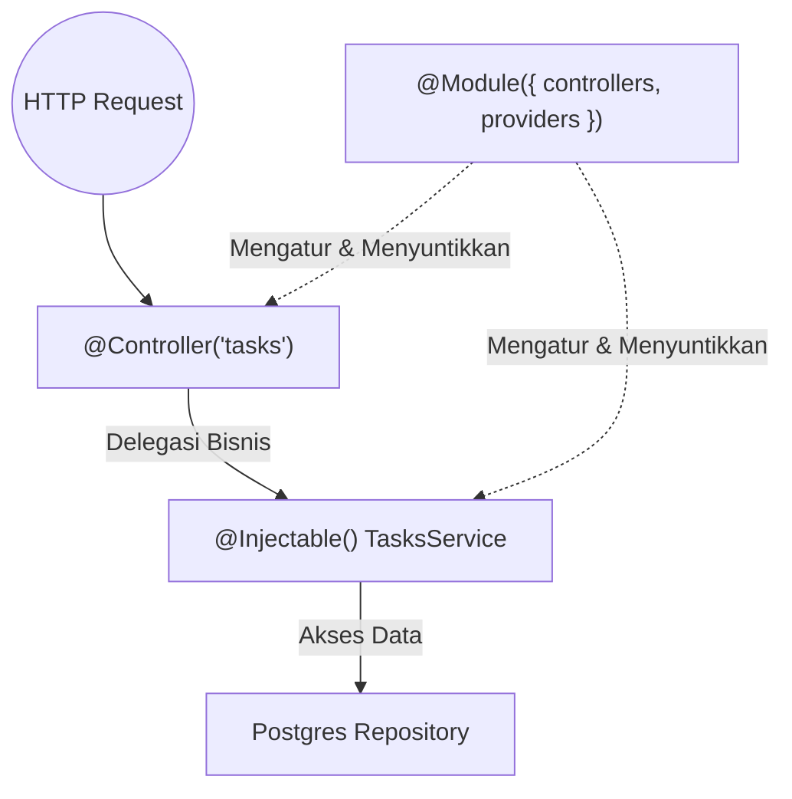

# 🟢 LEVEL 2 — MODUL 9: ENTERPRISE RESTFUL API (NESTJS ARCHITECTURE)
## LESSON 9.1: NestJS Core Mental Model, Modules, Controllers, Services & Dependency Injection (IoC)

---

### 📋 Prerequisite & Metadata
- **Prerequisite:** [Modul 4: TypeScript Fundamentals](file:///c:/Users/ADVAN/OneDrive/Dokumen/SOFTWARE%20ENGINEERING%20BOOTCAMP/level-1-fundamental/module-4-typescript/lesson-4.1-typescript-fundamentals.md) & [Modul 7: Backend Node.js](file:///c:/Users/ADVAN/OneDrive/Dokumen/SOFTWARE%20ENGINEERING%20BOOTCAMP/level-2-intermediate/module-7-backend-nodejs/lesson-7.2-http-middleware.md)
- **Learning Objectives:**
  1. Memahami mengapa arsitektur enterprise membutuhkan struktur opini yang baku (*Opinionated Framework*) dibandingkan struktur liar (*Wild-West* Express).
  2. Menguasai pola **Inversion of Control (IoC)** dan **Dependency Injection (DI)**: bagaimana NestJS Runtime mengelola siklus hidup (*Lifecycle*) dan instansiasi objek secara otomatis.
  3. Memahami pemisahan tanggung jawab (*Separation of Concerns*):
     - **`@Controller()`**: Menangani rute HTTP, ekstraksi request parameter/body, dan pengembalian respon.
     - **`@Injectable() Service`**: Menampung logika bisnis inti (*Core Business Logic*).
     - **`@Module()`**: Mengelompokkan domain fungsional dan mendeklarasikan *providers* serta *exports*.
  4. Mampu merancang REST API domain modular untuk entitas TaskFlow.
- **Required Knowledge:** TypeScript decorators, classes, dan asynchronous async/await.
- **Estimated Difficulty:** 🟡 Menengah – Lanjutan
- **Estimated Study Time:** ±85 menit
- **Completion Criteria:** Berhasil membangun modul NestJS lengkap (`TasksModule`, `TasksController`, `TasksService`) dengan injeksi dependensi yang bersih dan terisolasi untuk pengujian unit.

---

### 🏷️ Klasifikasi Standar Industri
- **MUST KNOW (Wajib):** `@Module()`, `@Controller()`, `@Get()`, `@Post()`, `@Param()`, `@Body()`, `@Injectable()`, Constructor-based Dependency Injection, Single Responsibility Principle.
- **SHOULD KNOW (Penting):** Scope Provider (DEFAULT / Singleton vs REQUEST vs TRANSIENT), Custom Providers (`useClass`, `useValue`, `useFactory`), Dynamic Modules (`forRoot`, `forFeature`).
- **NICE TO KNOW (Lanjutan):** Circular Dependency Resolution (`forwardRef()`), ModuleRef API untuk dynamic resolution, Request-scoped caching.

---

### 🧠 Technology Decision Framework: Backend Framework Selection (NestJS vs Express vs Fastify)

| # | Dimensi Evaluasi | NestJS (Terpilih untuk Enterprise) | Express.js (Unopinionated) | Fastify Native |
| :-: | :--- | :--- | :--- | :--- |
| **1** | **Problem Solved** | Menyediakan arsitektur terstruktur standar enterprise (mirip Angular/Spring Boot) dengan TypeScript kelas satu (*first-class*), Dependency Injection bawaan, dan modularitas yang sangat terukur. | Menyediakan fondasi routing minimalis di atas `node:http` tanpa memaksakan struktur folder atau pola desain apa pun. | Mengatasi bottleneck performa throughput HTTP dengan skema JSON compile-time tercepat di Node.js. |
| **2** | **Why This vs Alternatives?** | Dalam tim beranggotakan puluhan developer, Express sering berujung menjadi *"Spaghetti Code"* di mana setiap engineer membuat pola struktur sendiri. NestJS memaksakan konvensi arsitektur yang seragam, mudah di-test, dan *maintainable*. | Express bagus untuk belajar dasar atau microservice 1 file, namun rapuh untuk aplikasi backend kompleks jangka panjang. | Fastify sangat cepat, namun NestJS sendiri dapat menggunakan Fastify sebagai HTTP engine di bawahnya (`NestFastifyApplication`)! |
| **3** | **When to Use?** | Aplikasi SaaS berskala menengah hingga enterprise, API perbankan, backend e-commerce, sistem multi-domain (*TaskFlow Enterprise*). | Prototipe kilat 1 hari, microservice utilitas serverless ultra-sederhana. | Layanan proxy ber-throughput tinggi (*high-frequency streaming/telemetry*). |
| **4** | **When NOT to Use?** | Script serverless lambda 1 fungsi berukuran kecil di mana cold-start time dihitung dalam milidetik dan ukuran bundle harus super minimalis. | Sistem skala besar yang akan dikelola oleh tim banyak orang selama bertahun-tahun. | Proyek yang membutuhkan arsitektur modular terstandarisasi. |
| **5** | **Trade-offs / Downsides** | *Learning Curve* lebih tinggi: developer harus memahami TypeScript Decorators, metadata refleksi, dan konsep IoC/DI. | Beban perancangan arsitektur, validasi data, dan testing 100% dipikul manual oleh developer; rawan arsitektur bobrok. | Ekosistem plugin komunitas lebih kecil dibanding Express murni. |
| **6** | **Production Considerations** | Manfaatkan `ConfigModule` untuk variabel environment berbasis validasi Joi/Zod; gunakan Singleton scope (default) untuk efisiensi memori. | Butuh middleware boilerplate ekstra untuk CORS, Helmet, rate-limiter, dan body-parser. | Perhatikan kompatibilitas middleware pihak ketiga yang dirancang untuk Express. |
| **7** | **Evolution Path** | **Modular Monolith** $\rightarrow$ Microservices (via gRPC / Kafka / RabbitMQ) dengan abstraksi transport NestJS tanpa merombak logika controller! | Sering terpaksa di-rewrite total ke NestJS / Go ketika kode melampaui 10.000 baris. | Fastify standalone $\rightarrow$ Fastify under NestJS. |

---

### 1. WHY (Mengapa Arsitektur NestJS & Inversion of Control Dibutuhkan?)
Di Express murni, developer pemula sering menulis kode seperti ini:
```typescript
// ❌ Tight Coupling (Keterikatan Ketat yang Merusak Testability):
app.post("/tasks", async (req, res) => {
  const db = new PostgresDatabaseConnection(); // Membuat koneksi langsung di dalam route!
  const emailService = new SmtpEmailService();
  
  await db.query("INSERT INTO tasks...");
  await emailService.sendNotification();
  res.json({ success: true });
});
```
Masalah fatal:
1. **Sulit Di-Unit Test:** Bagaimana Anda menguji rute ini tanpa menyalakan server database Postgres sungguhan dan mengirim email nyata? Anda tidak bisa me-mock objek `db` karena objek tersebut di-*hardcode* via `new`.
2. **Memory Leak:** Setiap kali ada request masuk, koneksi baru terus diciptakan tanpa reuse instance (*No Singleton Pool*).

**Solusi: Dependency Injection (DI).** Controller tidak boleh membuat dependensinya sendiri. Sebaliknya, dependensi *disuntikkan* dari luar oleh IoC Container.

---

### 2. WHAT (Apa Konsep Inti NestJS?)



1. **`@Module`**: Kapsul isolasi domain. Mengatur dependensi apa saja yang ada di domain tersebut (`controllers`, `providers`, `exports`, `imports`).
2. **`@Controller`**: Menerima request HTTP (`GET`, `POST`, `PATCH`, `DELETE`), mengekstrak parameter, dan memanggil Service. Controller dilarang memuat logika SQL atau kalkulasi bisnis rumit!
3. **`@Injectable` (Service/Provider)**: Kelas yang berisi logika bisnis murni. Dapat disuntikkan ke kelas lain melalui parameter constructor.
4. **IoC Container**: Mesin internal NestJS yang otomatis membaca tipe parameter constructor, membuat instance Service sekali saja (Singleton), dan menyuntikkannya ke Controller saat aplikasi pertama kali menyala.

---

### 3. ANALOGY (Analogi)
Bayangkan sebuah **Restoran Bintang Lima**:
- **Tamu Restoran:** Client HTTP yang mengirim request pesanan makanan.
- **Pelayan Restoran (`@Controller`):** Menyambut tamu di meja, mencatat menu pesanan (`@Body()`), memastikan format pesanan jelas, lalu membawa tiket pesanan ke dapur. Pelayan **tidak memasak** steak sendiri!
- **Koki Dapur (`@Injectable` Service):** Menerima tiket pesanan dari pelayan, mengolah daging steak dengan resep rahasia (*Business Logic*), lalu menyerahkan piring hidangan kembali ke pelayan.
- **Pihak Manajemen Restoran (`@Module` & IoC Container):** Menyiapkan pisau, wajan, dan gas sebelum restoran buka, lalu menyediakannya ke meja kerja koki agar koki tinggal pakai tanpa harus membuat wajan sendiri.

---

### 4. HOW (Sintaks Membangun Modul NestJS)

#### A. Membuat Service:
```typescript
import { Injectable, NotFoundException } from "@nestjs/common";

export interface Task {
  id: number;
  title: string;
  isDone: boolean;
}

@Injectable()
export class TasksService {
  private tasks: Task[] = [
    { id: 1, title: "Belajar NestJS Core", isDone: true }
  ];

  findAll(): Task[] {
    return this.tasks;
  }

  findById(id: number): Task {
    const task = this.tasks.find(t => t.id === id);
    if (!task) {
      throw new NotFoundException(`Task dengan ID ${id} tidak ditemukan`);
    }
    return task;
  }

  create(title: string): Task {
    const newTask: Task = {
      id: this.tasks.length + 1,
      title,
      isDone: false
    };
    this.tasks.push(newTask);
    return newTask;
  }
}
```

#### B. Membuat Controller dengan Injeksi Dependensi:
```typescript
import { Controller, Get, Post, Param, Body, ParseIntPipe } from "@nestjs/common";
import { TasksService, Task } from "./tasks.service";

@Controller("tasks")
export class TasksController {
  // Dependency Injection melalui constructor:
  constructor(private readonly tasksService: TasksService) {}

  @Get()
  getAllTasks(): Task[] {
    return this.tasksService.findAll();
  }

  @Get(":id")
  getTaskById(@Param("id", ParseIntPipe) id: number): Task {
    return this.tasksService.findById(id);
  }

  @Post()
  createTask(@Body("title") title: string): Task {
    return this.tasksService.create(title);
  }
}
```

#### C. Merangkai di dalam Module:
```typescript
import { Module } from "@nestjs/common";
import { TasksController } from "./tasks.controller";
import { TasksService } from "./tasks.service";

@Module({
  controllers: [TasksController],
  providers: [TasksService],
  exports: [TasksService], // Diexport jika dibutuhkan modul lain
})
export class TasksModule {}
```

---

### 5. CODE (Contoh Clean Code: TaskFlow Domain Service & Controller)

Berikut contoh implementasi standar arsitektur bersih (*Clean Architecture*) di mana interface repository diabstraksikan untuk memfasilitasi kemudahan unit testing:

```typescript
// ====================================================================
// 1. DOMAIN INTERFACE & DTO
// ====================================================================
export interface TaskEntity {
  id: string;
  workspaceId: string;
  title: string;
  priority: "LOW" | "MEDIUM" | "HIGH" | "URGENT";
  isCompleted: boolean;
  createdAt: Date;
}

export interface ITaskRepository {
  findByWorkspace(workspaceId: string): Promise<TaskEntity[]>;
  create(task: Omit<TaskEntity, "id" | "createdAt">): Promise<TaskEntity>;
}

// ====================================================================
// 2. INJECTABLE SERVICE DENGAN VALIDASI BISNIS
// ====================================================================
export class TasksDomainService {
  constructor(private readonly taskRepository: ITaskRepository) {}

  async getWorkspaceTasks(workspaceId: string): Promise<TaskEntity[]> {
    if (!workspaceId) {
      throw new Error("Workspace ID wajib disertakan");
    }
    return this.taskRepository.findByWorkspace(workspaceId);
  }

  async addTask(workspaceId: string, title: string, priority: TaskEntity["priority"] = "MEDIUM"): Promise<TaskEntity> {
    if (!title || title.trim().length < 3) {
      throw new Error("Judul tugas minimal terdiri dari 3 karakter");
    }

    return this.taskRepository.create({
      workspaceId,
      title: title.trim(),
      priority,
      isCompleted: false,
    });
  }
}
```

---

### 6. BEST PRACTICE (Standar Industri)
1. **Rampingkan Controller, Tebalkan Service (*Skinny Controllers, Fat Services*):**
   Controller hanya bertugas memetakan HTTP request dan status code. Semua logika validasi bisnis, perhitungan data, dan pemanggilan database harus bermukim di Service.
2. **Gunakan Constructor Injection dengan Keyword `readonly`:**
   Selalu deklarasikan parameter constructor sebagai `private readonly myService: MyService`. Ini mencegah dependensi tertimpa (*overwritten*) secara tidak sengaja di runtime.
3. **Hindari Mengakses `req` dan `res` Secara Manual:**
   Jangan menyuntikkan `@Req()` atau `@Res()` dari Express murni kecuali sangat terpaksa. Menggunakan `@Res()` mematikan fitur otomatis serialization NestJS dan mengunci aplikasi ke platform Express (kehilangan kemampuan beralih ke Fastify).

---

### 7. COMMON MISTAKES (Kesalahan Umum Pemula)
- ❌ **Melakukan `new MyService()` Sendiri:** Menulis `const service = new TasksService()` di dalam Controller. Ini merusak pola IoC NestJS dan membuat service tidak bisa menerima injeksi dependensi lainnya.
- ❌ **Lupa Mendaftarkan Service di Array `providers` Module:** Membuat kelas `@Injectable()` namun lupa menambahkannya ke `providers: [...]` di file `.module.ts`. Akibatnya NestJS akan melempar runtime error: `Nest can't resolve dependencies of the TasksController...`.
- ❌ **Menyimpan State Pengguna di dalam Property Service:** Menyimpan data request spesifik (misal `currentUser`) di variabel instance Service Singleton. Di NestJS, Service secara default adalah **Singleton** (1 instance dibagi ke seluruh pengguna aplikasi). Menyimpan state pengguna di properti service akan menyebabkan kebocoran data antar pengguna (*Race Condition & Data Leak*)!

---

### 8. EXERCISE (Latihan Mandiri)

> 📍 *Kerjakan latihan ini di file:* [lesson-9.1-practice.ts](file:///c:/Users/ADVAN/OneDrive/Dokumen/SOFTWARE%20ENGINEERING%20BOOTCAMP/level-2-intermediate/module-9-enterprise-nestjs/lesson-9.1-practice.ts)

**Skenario Bisnis: Task Prioritization & Assignment Service**
Buatlah implementasi modul backend TaskFlow dengan spesifikasi:
1. Kelas `TaskAssignmentService`:
   - Method `assignTask(taskId: number, assigneeEmail: string)`:
     - Validasi: Email harus valid (mengandung `@`).
     - Jika task sudah berstatus `isDone: true`, lemparkan error: `"Tidak dapat menugaskan task yang sudah selesai"`.
     - Kembalikan objek task yang telah diperbarui dengan properti `assignedTo: assigneeEmail`.
2. Kelas `TaskAssignmentController`:
   - Menginjeksikan `TaskAssignmentService` via constructor.
   - Endpoint `POST /tasks/:id/assign`:
     - Menerima `:id` dan body `{ "email": "engineer@company.com" }`.
     - Memanggil service dan mengembalikan respon JSON berstatus sukses.

---

### 9. DEBUGGING (Mendiagnosis Dependency Injection Error)

Perhatikan pesan crash server NestJS berikut saat pertama kali dijalankan (`npm run start`):

```text
[Nest] 18420  - ERROR [ExceptionHandler] Nest can't resolve dependencies of the WorkspacesController (?). Please make sure that the argument WorkspacesService at index [0] in the WorkspacesController class is available in the WorkspacesModule context.

Potential solutions:
- Is WorkspacesModule a valid NestJS module?
- If WorkspacesService is a provider, is it part of the current WorkspacesModule?
- If WorkspacesService is exported from a separate @Module, is that module imported within WorkspacesModule?
```

**Tugasmu:**
Apa penyebab error di atas dan 2 langkah konkret apa di file `workspaces.module.ts` untuk memperbaikinya?

---

### 10. SOLUTION (Kunci Jawaban)

<details>
<summary>💡 Buka HINT untuk Exercise</summary>

Gunakan constructor injection:
```typescript
constructor(private readonly assignmentService: TaskAssignmentService) {}
```
Validasi format email dengan regex sederhana: `assigneeEmail.includes('@')`.
</details>

<br>

<details>
<summary>✅ Buka SOLUTION untuk Exercise</summary>

Lihat file implementasi lengkap di:
[lesson-9.1-practice.ts](file:///c:/Users/ADVAN/OneDrive/Dokumen/SOFTWARE%20ENGINEERING%20BOOTCAMP/level-2-intermediate/module-9-enterprise-nestjs/lesson-9.1-practice.ts).
</details>

<br>

<details>
<summary>✅ Buka SOLUTION untuk Debugging</summary>

**Penyebab Error:**
`WorkspacesController` mendeklarasikan dependensi ke `WorkspacesService` di constructor-nya, namun IoC Container NestJS tidak menemukan instance `WorkspacesService` di dalam cakupan konteks `WorkspacesModule`.

**Solusi Perbaikan:**
Buka file `workspaces.module.ts`:
1. Pastikan `WorkspacesService` diimpor dari filenya.
2. Tambahkan `WorkspacesService` ke dalam array **`providers`**:
```typescript
import { Module } from '@nestjs/common';
import { WorkspacesController } from './workspaces.controller';
import { WorkspacesService } from './workspaces.service';

@Module({
  controllers: [WorkspacesController],
  providers: [WorkspacesService], // <-- WAJIB DIDAFTARKAN DI SINI!
})
export class WorkspacesModule {}
```
</details>

---

### 11. RECAP (Ringkasan Kunci)
1. **NestJS** memecahkan masalah arsitektur tidak teratur pada Express dengan memaksakan struktur modular berstandar enterprise.
2. **Dependency Injection (DI)** memisahkan penciptaan objek dari penggunaannya, membuat kode sangat modular, fleksibel, dan mudah di-mock dalam unit test.
3. **Controllers** hanya menangani jalur HTTP, sedangkan **Services** memegang kendali atas logika bisnis domain.
4. **Modules** adalah batas isolasi domain yang menyatukan controller dan service.

---

### 12. IMPORTANT TO REMEMBER
> **"Don't call us, we'll call you (Inversion of Control)."**
> Jangan membuat instance service dengan `new` di dalam controller. Biarkan framework NestJS yang menciptakan dan menyuntikkannya untuk Anda melalui constructor.
