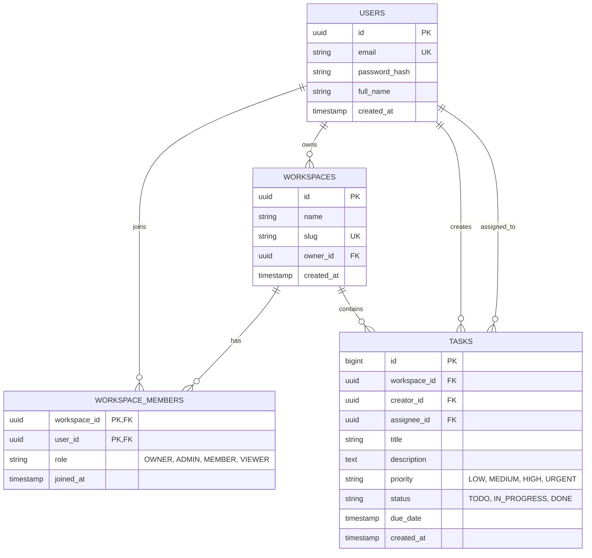

# 🏆 PROJECT 2: Production-Ready TaskFlow Backend API
## Company-Grade Engineering Specification & Architecture Blueprint

---

### 📌 Document Control
- **Product:** TaskFlow Enterprise Backend Platform
- **Document Type:** System Architecture Document (SAD) & Engineering Specification
- **Level:** Level 2 (Intermediate — Backend, Database & Cloud)
- **Status:** Approved for Implementation (Production-Grade)
- **Author:** Senior Backend & Platform Architect

---

## 1. BUSINESS REQUIREMENTS & PROBLEM STATEMENT

### 1.1 Business Context
Di Level 1, tim frontend telah membangun purwarupa interaktif TaskFlow menggunakan Next.js App Router dan TypeScript. Namun, seluruh data tugas saat itu masih bersifat *in-memory mockup* di sisi klien.

Pada Level 2 ini, divisi engineering diinstruksikan membangun **TaskFlow Production Backend Microservice Engine** yang:
1. Menyimpan data secara aman di **PostgreSQL** dengan kepatuhan penuh transaksi ACID dan skema relasional 3NF.
2. Membuka layanan **RESTful API** berbasis **NestJS** yang menerapkan prinsip *Clean Architecture*, *Inversion of Control*, dan *DTO Whitelist Sanitization*.
3. Menerapkan pengamanan **Zero-Trust Security**: enkripsi password ber-salt, stateless JWT, otorisasi peran berjenjang (*RBAC*), serta proteksi mutlak terhadap celah *Insecure Direct Object Reference (IDOR)*.
4. Dikemas dalam **Multi-Stage Docker Image** dan diorkestrasi menggunakan **Docker Compose** dengan pengujian unit otomatis di pipeline **GitHub Actions CI/CD**.

---

## 2. SYSTEM ARCHITECTURE & COMPONENT TOPOLOGY

```mermaid
graph TD
    subgraph Client Tier
        Frontend[Next.js App / Mobile Client]
    end

    subgraph Security & Perimeter Tier
        WAF[Rate Limiter / Throttler]
        JWTGuard[JwtAuthGuard (Bearer Token)]
        RBACGuard[RolesGuard & OwnershipGuard]
    end

    subgraph Application Tier (NestJS Clean Architecture)
        Controller[REST Controllers: Auth, Workspaces, Tasks]
        Pipe[ValidationPipe (Whitelist Sanitization)]
        Service[Domain Services (Business Logic & Lifecycles)]
        Repo[Repository Layer (Data Abstraction)]
    end

    subgraph Data & Persistence Tier (Docker Network)
        DB[(PostgreSQL 16 Engine - 3NF Schema)]
        Vol[(Named Volume: taskflow_postgres_data)]
        Cache[(Redis 7 Cache / Blacklist)]
    end

    Frontend -->|HTTP / HTTPS| WAF
    WAF --> JWTGuard
    JWTGuard --> RBACGuard
    RBACGuard --> Pipe
    Pipe --> Controller
    Controller --> Service
    Service --> Repo
    Repo --> DB
    Repo --> Cache
    DB --- Vol
```

---

## 3. DATABASE RELATIONAL ERD (POSTGRESQL 3NF)



---

## 4. API SPECIFICATION & ROUTING CONTRACT

| Method | Endpoint | Auth Guard | Allowed Roles | Description | Status Code |
| :--- | :--- | :---: | :---: | :--- | :---: |
| `POST` | `/api/v1/auth/register` | None | Public | Registrasi akun pengguna baru dengan password hashing | `201 Created` |
| `POST` | `/api/v1/auth/login` | None | Public | Autentikasi kredensial dan penerbitan token JWT | `200 OK` |
| `GET` | `/api/v1/workspaces` | `JwtAuth` | All Authenticated | Mendapatkan seluruh workspace yang diikuti user | `200 OK` |
| `POST` | `/api/v1/workspaces` | `JwtAuth` | All Authenticated | Membuat workspace baru (pembuat otomatis jadi OWNER) | `201 Created` |
| `DELETE` | `/api/v1/workspaces/:id`| `JwtAuth` | `OWNER` Only | Menghapus workspace (Dilindungi IDOR Ownership Guard) | `200 OK` / `403` |
| `GET` | `/api/v1/workspaces/:id/tasks` | `JwtAuth` | Workspace Members | Mengambil daftar tugas dalam workspace dengan filter | `200 OK` |
| `POST` | `/api/v1/workspaces/:id/tasks` | `JwtAuth` | `OWNER`, `ADMIN`, `MEMBER` | Membuat tugas baru dengan DTO whitelist validation | `201 Created` |
| `PATCH`| `/api/v1/tasks/:id` | `JwtAuth` | Assignee / Admin | Memperbarui status / judul tugas | `200 OK` |
| `GET` | `/api/v1/workspaces/:id/analytics` | `JwtAuth` | `OWNER`, `ADMIN` | Kueri analitik metrik performa beban kerja tim | `200 OK` |
| `GET` | `/health` | None | Public | Healthcheck probe untuk orkestrasi Docker | `200 OK` |

---

## 5. NON-FUNCTIONAL REQUIREMENTS & QUALITY TARGETS

1. **Keamanan (Security SLA):**
   - Tidak ada password plaintext yang tersimpan di sistem (*Salted Scrypt Hashing*).
   - Seluruh input body difilter dari serangan *Mass Assignment* (`whitelist: true, forbidNonWhitelisted: true`).
   - Setiap endpoint penghapusan data terlindungi dari serangan manipulasi ID (*Zero IDOR tolerance*).
2. **Kinerja (Performance SLA):**
   - Waktu respon rata-rata untuk operasi baca di bawah 50 milidetik (*p95 < 50ms*).
   - Kueri analitik dashboard dioptimalkan dengan indeks komposit dan agregasi *Single-Pass*.
3. **Resilience & Testing:**
   - 100% lulus pada automated integration & unit test suites.
   - Pipeline CI/CD otomatis di GitHub Actions memvalidasi integritas sebelum branch `main` diperbarui.
