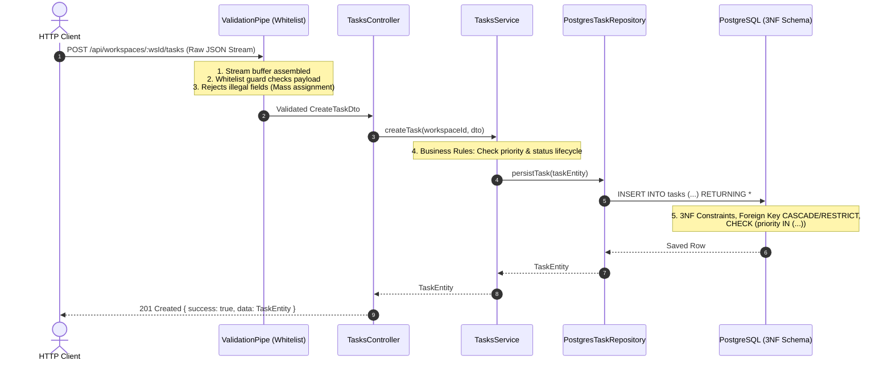

# 🎯 REVIEW 3: INTEGRASI ARSITEKTUR BACKEND ENTERPRISE
## Spaced Review & Uji Integrasi Modul 7, 8, dan 9
### (Node.js Streams + PostgreSQL 3NF Database + NestJS Clean Architecture)

---

### 📋 Prerequisite & Metadata
- **Cakupan Modul:**
  - [Modul 7: Backend Engineering (Node.js)](file:///c:/Users/ADVAN/OneDrive/Dokumen/SOFTWARE%20ENGINEERING%20BOOTCAMP/level-2-intermediate/module-7-backend-nodejs/lesson-7.1-nodejs-runtime.md)
  - [Modul 8: Database Engineering (PostgreSQL & SQL)](file:///c:/Users/ADVAN/OneDrive/Dokumen/SOFTWARE%20ENGINEERING%20BOOTCAMP/level-2-intermediate/module-8-database-postgresql/lesson-8.1-relational-modeling.md)
  - [Modul 9: Enterprise RESTful API (NestJS Architecture)](file:///c:/Users/ADVAN/OneDrive/Dokumen/SOFTWARE%20ENGINEERING%20BOOTCAMP/level-2-intermediate/module-9-enterprise-nestjs/lesson-9.1-nestjs-architecture.md)
- **Tujuan Integrasi:**
  Membuktikan kemampuan mengintegrasikan 3 pilar backend modern dalam satu solusi terpadu untuk **TaskFlow Enterprise Microservice**:
  1. *Stream & Payload Safety (Node.js Core):* Membatasi dan merakit payload stream buffer chunks secara asinkron non-blocking.
  2. *Relational Modeling & Integrity (PostgreSQL):* Memastikan data mematuhi skema relasional 3NF, kunci unik, foreign key, dan validasi domain `CHECK`.
  3. *Clean Architecture & DI (NestJS):* Mengalirkan request dari DTO ber-whitelist $\rightarrow$ Controller $\rightarrow$ Service $\rightarrow$ Repository dengan perlakuan Exception Filter terpusat.
- **Estimated Difficulty:** 🟡 Menengah – Lanjutan
- **Estimated Time:** ±90 menit

---

### 🏗️ Diagram Alur Integrasi (End-to-End Request Lifecycle)



---

### 📝 Kriteria Keberhasilan Integrasi (Review Gate Rubric):

1. **Safety at the Perimeter (Perimeter Defense):**
   - Payload di atas 1MB ditolak secara dini sebelum menghabiskan RAM.
   - Properti ilegal di luar DTO (seperti `isAdmin`, `isOwner`, atau atribut tak berizin) ditolak dengan status `400 Bad Request`.

2. **Inversion of Control & Loose Coupling:**
   - Database layer diabstraksikan di balik interface `ITaskRepository` sehingga dapat di-swap antara PostgreSQL, Prisma, atau Mock Test Memory tanpa menyentuh satu baris pun kode di Service maupun Controller.

3. **Domain Integrity & PostgreSQL Compatibility:**
   - Struktur data task sepenuhnya mematuhi skema DDL PostgreSQL Modul 8 (tipe UUID, enum priority, foreign key ke workspace).
   - Pengubahan status dan prioritas mematuhi aturan bisnis transaksional.

4. **Resilience & Centralized Formatting:**
   - Tidak ada kebocoran error native `500` maupun *stack trace* database ke client.
   - Respon sukses dan gagal dibungkus secara konsisten dalam format standar industri.

---

### 📂 File Implementasi & Uji Otomatis
- Script Integrasi & Test Suite: [review-3-integration.ts](file:///c:/Users/ADVAN/OneDrive/Dokumen/SOFTWARE%20ENGINEERING%20BOOTCAMP/level-2-intermediate/review-3/review-3-integration.ts)

Jalankan pengujian integrasi ini menggunakan:
```bash
node --experimental-strip-types level-2-intermediate/review-3/review-3-integration.ts
```
